# Q1
1.  
   - CPU model:Intel(R) Core(TM) i5-1035G1
   - 10th generation
   - Frequency range:1-3.6 GHz
   - No. of cores:4
   - Hyper threading availability:Yes
   - SIMD ISA: Yes, Intel® SSE4.1, Intel® SSE4.2, Intel® AVX2, Intel® AVX-512
   - Cache size:6 MB
   - Max main memory bandwidth: 58.3 GB/s

2. FLOPS(theoretical) per core=1*3600*1e6*16=115200*1e6=57.6 GFLOPs
   FLOPS(theoretical) per processor=1*4*3600*1e6*16=115200*1e6=330.4 GFLOPs

   With FMA however FLOPs per cycle will be 32

   FLOPS(theoretical) per core=1*3600*1e6*32=115200*1e6=115.2 GFLOPs
   FLOPS(theoretical) per processor=1*4*3600*1e6*32=115200*1e6=660.8 GFLOPs

   - Using the whetstone program for bench-marking the GFlops obtained 
   
   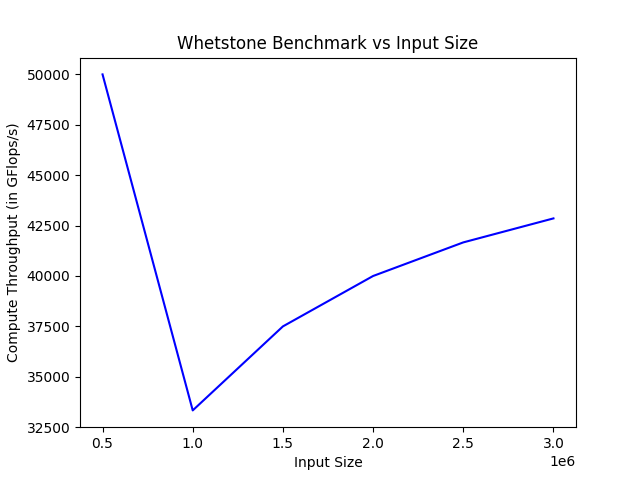

3. 
    - Main memory size : 8GB, max main memory size: 64GB
    - DDR4
    - Max Memory Bandwidth: 58.3 GB/s
    - Using the stream benchmark , we get an average memory bandwidth of around 15 GB/s
    - For the sake of calculating the system’s memory bandwidth benchmark , I do the following
   1. Matrix - Matrix Multiplication , since it is a memory intensive program ( requiring accessing huge n x n matrices A , B and C ) and thus calculating the matrix multiplication operations .
   2. I wrote a code , for copying a vector A to vector B , and compared the results with that obtained from the stream benchmark , with the stream benchmark which gave an approx memory bandwidth of 10 GB/s ,  I wrote a similar code , and tried to optimise the given code using strategies like - loop unrolling , vectorisation, parallelisation, etc.

4. 
    - Secondary structure storage size: 512 GB
    - SSD
    - Disk write speed: 977 MB/s
    - Disk read speed : 1.3 GB/s
5. Done

# Q2

- ADA Peak FLOPs: 70.66 TFLOPS
- Abacus Peak FLOPs: 14 TFLOPS

# BLAS-Level-1
## SSCAL
1. Operational Intensity=(No. of operations performed)/(Bytes of memory fetched) = (N)/(4*N) = 0.25
2. 45.5 ms (2.21 GFLOPs) using icc -O3, 44 ms (2.25 GFLOPs) using gcc -O3
3. Baseline execution time = 262.585 ms (0.38 GFLOPs) and best execution time = 36.104000 ms (2.56 GFLOPs)
4. Average GFLOPs overall = 2.23 
5. Speedup = 2.56-2.23 = 0.33 GFLOPs
6. Baseline = 0.38 GFLOPs
7. Memory bandwidth achieved = 9.05 GBytes/s
8. The program is memory bound
### Techniques used for optimisation:
`#pragma omp simd` was used for vectorization which gave results that were only marginally better than without it.
`#pragma omp parallel` and `#pragma omp for simd` were used for both parallelization and vecorizaton and the results were again about the same as before

### Comparison wth BLIS
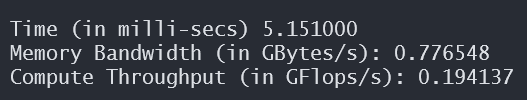

## DSCAL
1. Operational Intensity=(No. of operations performed)/(Bytes of memory fetched) = (N)/(8*N) = 0.125
2. 93.23 ms (1.07 GFLOPs) using icc -O3, 90.98 ms (1.10 GFLOPs) using gcc -O3
3. Baseline execution time = 288.55 ms (0.34 GFLOPs) and best execution time = 87.90 ms (1.13 GFLOPs)
4. Average GFLOPs overall = 1.08 
5. Speedup = 1.13-1.08 = 0.05 GFLOPs
6. Baseline = 0.34 GFLOPs
7. Memory bandwidth achieved = 9.10 GBytes/s
8. The program is memory bound
### Techniques used for optimisation:
`#pragma omp simd` was used for vectorization which gave results that were only marginally better than without it.
`#pragma omp parallel` and `#pragma omp for simd` were used for both parallelization and vecorizaton and the results were again about the same as before

## SAXPY
1. Operational Intensity=(No. of operations performed)/(Bytes of memory fetched)=(2*N)/(4*N+4*N)=0.25
2. 76.55 ms (2.61 GFLOPs) using icc -O3, 65.43 ms (3.06 GFLOPs) using gcc -O3
3. Baseline execution time=280.03 ms (0.71 GFLOPs) and best execution time=63.05 ms (3.16 GFLOPs)
4. Average GFLOPs overall = 2.52 GFLOPs 
5. Memory bandwidth achieved= 12.68 GBytes/s
6. Speedup= 3.16-2.52 = 0.64 GFLOPs
7. Baseline=0.71 GFLOPs
8. The program is memory bound
### Techniques used for optimisation:
`#pragma omp simd` was used for vectorization which gave results that were only marginally better than without it.
`#pragma omp parallel for` was used for parallelization which gave better results
`#pragma omp parallel` and `#pragma omp for simd` were used for both parallelization and vecorizaton and the results were significantly better with highest GFLOPs recorded as 3.16

### Coparison with BLIS

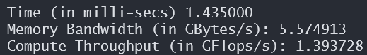

## DAXPY
1. Operational Intensity=(No. of operations performed)/(Bytes of memory fetched)=(2*N)/(8*N+8*N)=0.125
2. 139.45 ms (1.45 GFLOPs) using icc -O3, 137.13 ms (1.46 GFLOPs) using gcc -O3
3. Baseline execution time=300.94 ms (0.65 GFLOPs) and best execution time=133.05 ms (1.51 GFLOPs)
4. Average GFLOPs overall = 1.40 GFLOPs 
5. Memory bandwidth achieved= 12.06 GBytes/s
6. Speedup= 1.51-1.40= 0.11 GFLOPs
7. Baseline=0.65 GFLOPs
8. The program is memory bound
### Techniques used for optimisation:
`#pragma omp simd` was used for vectorization which gave results that were only marginally better than without it.
`#pragma omp parallel for` was used for parallelization which gave better results
`#pragma omp parallel` and `#pragma omp for simd` were used for both parallelization and vecorizaton and the results were significantly better with highest GFLOPs recorded as 3.16

# BLAS Level-2
## SGEMV    

**Note**: Different values of m and n were used in different cases
### Row major and No Transpose (sgemv)
Since the matrix is stored in row major format , we should decrease the memory access latency , by accessing the array in row-wise fashion . The operation then is a simple dot product between two vectors, and thus using the operation `cblas_sdot`

1. With icc -03 (no optimization) 6.78 GFLOPs(29.47 ms), with gcc -03 1.71 GFLOPs (116.12 ms)
2. baseline=0.74 GFLOPs (267.04 ms), best=19.27 ms(10.37 GFLOPs)
3. overall avg GFLOPs=5.67
4. memory bw achieved=20.75 GBytes/s
5. speedup=10.37-5.67=4.7 GFLOPs
6. baseline=0.74 GFLOPs
7. OI=(2mn+2m)/(4(mn+m+n)) which on taking limit turns out to be 0.5
8. **Techniques used for optimisation**: `#pragma omp parallel` and `#pragma omp for simd` were used for parallelization and vectorization in sdot and sgemv which gave the best result of 10.37 GFLOPs. Overall the results given by icc compiler with/without optimization turn out to be better than those from gcc.

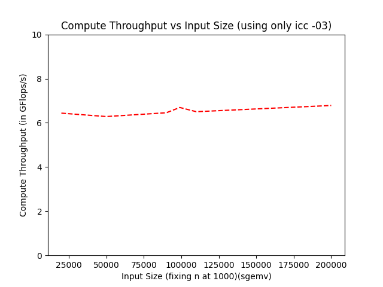

### Row major and Transpose (sgemv2)
Here the matrix is stored in transpose format. So it is better to use `saxpy` program from BLAS level 1. It will reduce memory access and thus reduce the latency in our computation.

1. best=9.11 GFLOPs(21.96 ms)
2. icc -O3 avg=6.61 GFLOPs GFLOPs(30.31 ms)
3. mem_bw=18.65 GBytes/s
4. gcc -O3 avg=5.35 GFLOPs(37.33 ms)
5. baseline=0.67 GFLOPs (295.06 ms) 
6. speed up=9.11-5.35=3.76 GFLOPs
7. OI=(2mn+2n)/(4(mn+m+n)) which on taking limit turns out to be 0.5
8. **Techniques used for optimisation**: `#pragma omp parallel` and `#pragma omp for simd` were used for parallelization and vectorization in sdot and sgemv which gave the best result of 9.11 GFLOPs. Overall the results given by icc compiler with/without optimization turn out to be better than those from gcc.

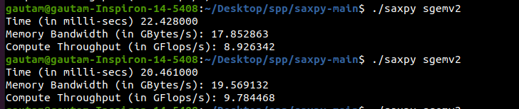

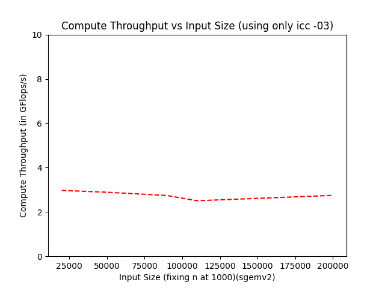

### Col major and No Transpose (sgemv3)
This is similar to the previous case. Since the matrix is stored in stored in column major fashion we again use the `cblas_saxpy` which reduces the memory access latency.
1. best=10.23(19.47 ms)
2. icc -O3 avg=5.57 GFLOPs(35.86 ms)
3. mem_bw=20.45
4. gcc -O3 avg=5.57(35.87 ms)
5. baseline=0.70 GFLOPs (307.86 ms) 
6. speed up=10.23-5.57=4.64 GFLOPs
7. OI=(2mn+2m)/(4(mn+m+n)) which on taking limit turns out to be 0.5
8. **Techniques used for optimisation**: `#pragma omp parallel` and `#pragma omp for simd` were used for parallelization and vectorization in sdot and sgemv which gave the best result of 10.23 GFLOPs. Overall the results given by icc compiler with/without optimization turn out to be better than those from gcc.

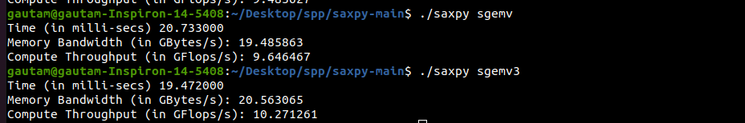

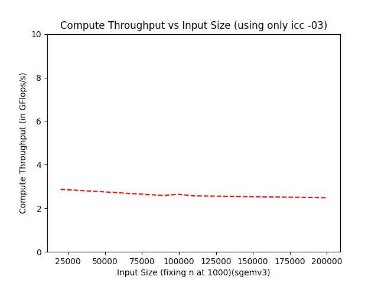

### Col major and Transpose (sgemv4)
Again, this is similar to the first case so we realize that using `cblas_sdot` is better than using saxpy
1. best=9.74(20.47 ms)
2. icc -O3 avg=5.80 GFLOPs(34.43 ms)
3. mem_bw=19.49
4. gcc -O3 avg=5.50(33.87 ms)
5. baseline=0.65 GFLOPs (320.56 ms) 
6. speed up=9.74-5.50=4.24 GFLOPs
7. OI=(2mn+2n)/(4(mn+m+n)) which on taking limit turns out to be 0.5
8. **Techniques used for optimisation**: `#pragma omp parallel` and `#pragma omp for simd` were used for parallelization and vectorization in sdot and sgemv which gave the best result of 9.74 GFLOPs. Overall the results given by icc compiler with/without optimization turn out to be better than those from gcc.

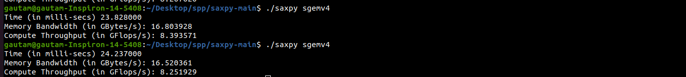

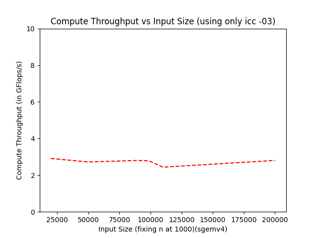

In all 4 cases the program is memory bound

- We already have the optimised routines for BLAS level 1 programs. Therefore, we can reduce our BLAS LEVEL 2 programs to the optimised BLAS level 1 routines , and make use of them to increase the performance of our functions

### Comparison with BLIS

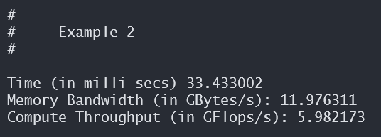

# BLAS Level 3

## SGEMM
OI=(2.0 * m * n * k + 2.0 * n * m)/((4.0 * (m * n + m * k + n * k)))

|Case| gcc -O3 (GFLOPs) | icc -O3 (GFLOPs)| gcc -O0 (GFLOPs)|Max mem bandwidth achieved(GBytes/s)|
|----|---------|---------|--------|-------------------------|
|sgemm (Row major,no trans,no trans)|11.93|2.84|0.73|0.15|
|sgemm2 (Row major,no trans,trans)|1.93|7.81|0.77|0.09|
|sgemm3 (Row major,trans,no trans)|12.45|2.80|0.71|0.14|
|sgemm4 (Row major, trans, trans)|1.92|7.85|0.72|0.09|
|sgemm5 (Col major,no trans,no trans)|1.95|7.46|0.75|0.08|
|sgemm6 (Col major,no trans, trans)|12.40|2.79|0.76|0.15|
|sgemm7 (Col major,trans,no trans)|1.86|7.58|0.72|0.09|
|sgemm8 (Col major, trans, trans)|12.55|2.82|0.77|0.15|

For BLAS Level-3, BLAS Level-2 routines were used that were already optimised.
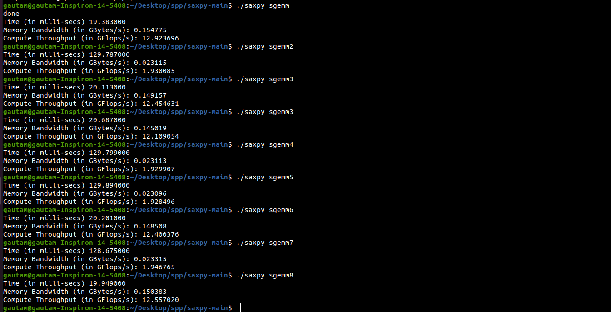

### Comparison with BLIS

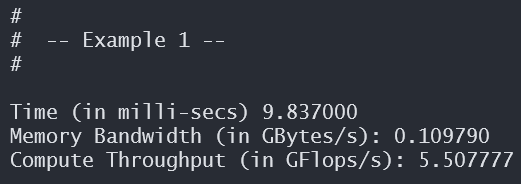

# Stencil
- We start with the naive way by using a for loop , that we could optimise in further iterations.
- Image dimensions= H*W , stencil dimension= k
- Memory fetched = , 4*h*w**2*k*k*
- Number of operation s =  number of iterations of the for loop= 2* H * W * k * k (factor of 2 for addition and multiplication).
- OI=0.25

icc -O3

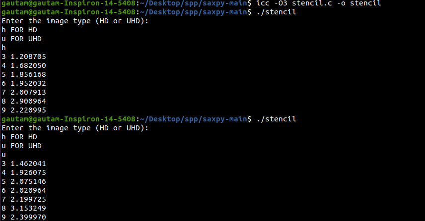

gcc -O3 (gives best GFLOPs)

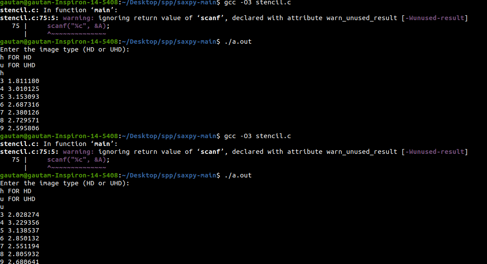

Baseline 

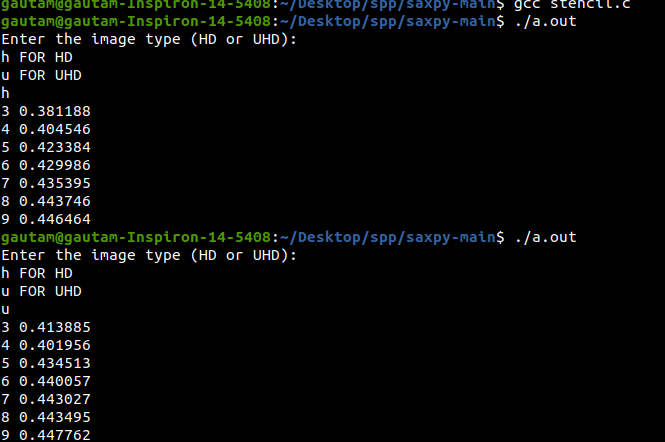

- Speedup = 3.15-0.45 = 2.70 GFLOPs
- The problem is memory bound

**Note**:A Program is Memory Bound because (O.I * Memory Bandwidth << Theoretically Observed Peak Flops)